# hotwired-mcp

MCP (Model Context Protocol) server for [Hotwired](https://hotwired.sh) multi-agent workflow orchestration.

## Why Open Source?

This MCP server runs on your machine. We open source it so you can:

- **Audit** exactly what code runs on your machine
- **Verify** there are no external network calls
- **Trust** that there's no hidden behavior
- **Build from source** if you prefer

## Architecture

**Everything runs locally on your machine.** There are no external service dependencies.

```mermaid
flowchart TB
    subgraph local["YOUR MACHINE"]
        subgraph desktop["Hotwired Desktop App"]
            core["Workflow Engine"]
            socket["Unix Socket Server<br/>~/.hotwired/hotwired.sock"]
        end

        subgraph agents["AI Coding Agents"]
            claude["Claude Code"]
            gemini["Google Gemini"]
            other["Other MCP-compatible agents"]
        end

        subgraph mcp["hotwired-mcp (this repo)"]
            tools["MCP Tools"]
            ipc["IPC Client"]
        end

        claude -->|"runs"| mcp
        gemini -->|"runs"| mcp
        other -->|"runs"| mcp

        ipc <-->|"Unix Socket<br/>(local IPC)"| socket
        socket <--> core
    end

    style local fill:#1a1a1a,stroke:#333
    style desktop fill:#2d2d2d,stroke:#444
    style agents fill:#2d2d2d,stroke:#444
    style mcp fill:#2d2d2d,stroke:#444
```



### How it works

1. **Hotwired Desktop App** runs locally and creates a Unix socket at `~/.hotwired/hotwired.sock`
2. **AI agents** (Claude Code, Gemini, etc.) run `hotwired-mcp` as their MCP server
3. **hotwired-mcp** communicates with the desktop app via the local Unix socket
4. **No external network calls** - all communication stays on your machine

The only external connection the Hotwired Desktop App makes is for **authentication**. All workflow orchestration, message passing, and coordination happens entirely locally.

## Installation

### Via npx (Recommended)

```bash
npx hotwired-mcp
```

### Via npm

```bash
npm install -g hotwired-mcp
hotwired-mcp
```

### Via Cargo (Build from Source)

```bash
cargo install --git https://github.com/hotwired-sh/hotwired-mcp
```

## Usage

### With Claude Code

Use the [Hotwired Claude Plugin](https://github.com/hotwired-sh/claude-plugin) which configures this automatically:

```bash
claude plugin install hotwired
```

### Manual MCP Configuration

Add to your MCP configuration:

```json
{
  "mcpServers": {
    "hotwired": {
      "command": "npx",
      "args": ["hotwired-mcp"],
      "env": {
        "ZELLIJ_SESSION_NAME": "${ZELLIJ_SESSION_NAME}"
      }
    }
  }
}
```

## Prerequisites

- [Hotwired Desktop App](https://hotwired.sh) - Must be running
- [Zellij](https://zellij.dev) - Terminal multiplexer for session management

## Available Tools

| Tool | Description |
|------|-------------|
| `get_protocol` | Fetch workflow protocol and role instructions |
| `get_run_status` | Check current run status |
| `report_status` | Update your working state |
| `send_message` | Send message to other participants |
| `request_input` | Ask human for input |
| `report_impediment` | Signal you're blocked |
| `handoff` | Hand work to another agent |
| `task_complete` | Mark a task as complete |

## Security

This MCP server:

- **Does NOT make any external network requests**
- Connects only to the local Unix socket (`~/.hotwired/hotwired.sock`)
- Does not read or modify files outside its scope
- Source code is fully auditable

## Development

```bash
# Build
cargo build --release

# Test
cargo test

# Run locally
cargo run
```

## License

MIT - See [LICENSE](LICENSE)

## Learn More

Visit [hotwired.sh](https://hotwired.sh) for documentation, tutorials, and more information about multi-agent workflow orchestration.
