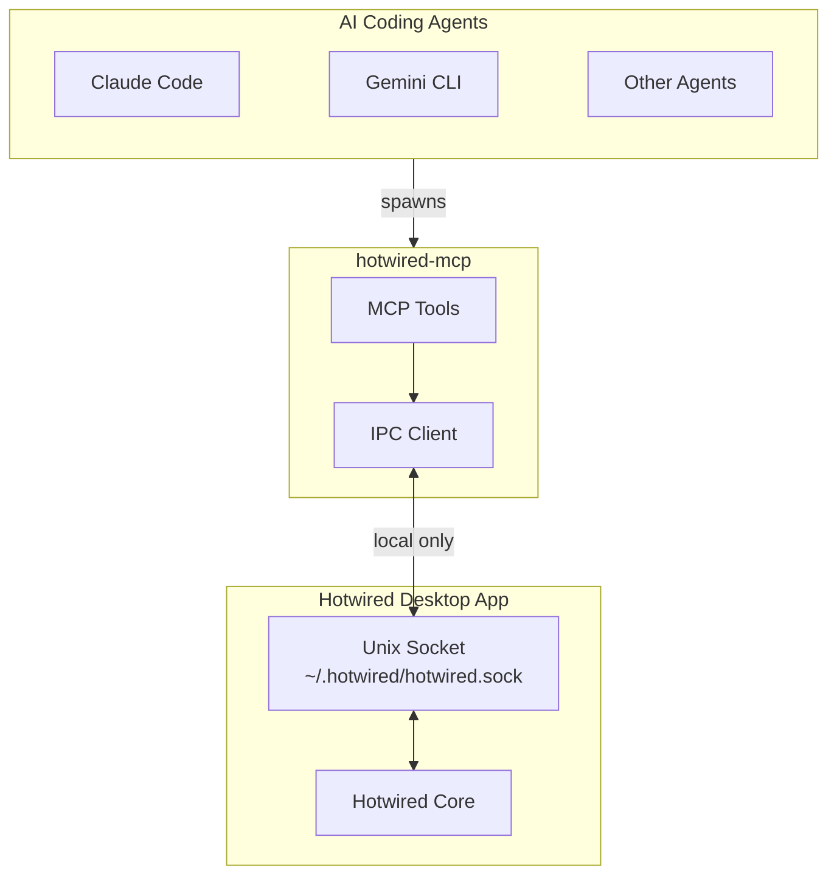

# hotwired-mcp


MCP (Model Context Protocol) server for [Hotwired](https://hotwired.sh) multi-agent workflow orchestration.

## Why Open Source?

This MCP server runs on your machine. We open source it so you can:

- **Audit** exactly what code runs on your machine
- **Verify** there are no external network calls
- **Trust** that there's no hidden behavior
- **Build from source** if you prefer

## Hotwired.sh Architecture

**Everything runs locally on your machine.** There are no external service dependencies.



### How it works

1. **Hotwired Desktop App** runs locally and creates a Unix socket at `~/.hotwired/hotwired.sock`
2. **AI agents** (Claude Code, Gemini, etc.) run `hotwired-mcp` as their MCP server
3. **hotwired-mcp** communicates with the desktop app via the local Unix socket
4. **No external network calls** - all communication stays on your machine

The only external connection the Hotwired Desktop App makes is for **authentication**. All workflow orchestration, message passing, and coordination happens entirely locally.

## Installation

### For Claude Code Users

**Just install the [Hotwired Claude Plugin](https://github.com/hotwired-sh/claude-plugin)** - it handles everything automatically:

```bash
claude plugin install hotwired
```

The plugin runs `npx @hotwired-sh/hotwired-mcp@latest` under the hood, so you'll always have the latest version. No manual installation needed.

### For Other MCP-Compatible Agents

Add to your MCP configuration:

```json
{
  "mcpServers": {
    "hotwired": {
      "command": "npx",
      "args": ["@hotwired-sh/hotwired-mcp@latest"]
    }
  }
}
```

### Building from Source

If you prefer to audit and build the code yourself:

```bash
cargo install --git https://github.com/hotwired-sh/hotwired-mcp
```

## Prerequisites

- [Hotwired Desktop App](https://hotwired.sh) - Must be running
- [Zellij](https://zellij.dev) - Terminal multiplexer for session management

## Available Tools

| Tool | Description |
|------|-------------|
| `get_protocol` | Fetch workflow protocol and role instructions |
| `get_run_status` | Check current run status |
| `report_status` | Update your working state |
| `send_message` | Send message to other participants |
| `request_input` | Ask human for input |
| `report_impediment` | Signal you're blocked |
| `handoff` | Hand work to another agent |
| `task_complete` | Mark a task as complete |

## Security

### Why Unix Sockets (Not HTTP/localhost)

We deliberately use **Unix sockets** instead of HTTP on localhost. This is a critical security design choice.

Many MCP tools have been vulnerable to **DNS rebinding attacks** and **0.0.0.0 bypass exploits** because they expose HTTP servers on localhost. These vulnerabilities allow malicious websites to:

- Send requests to localhost services via DNS rebinding
- Bypass browser same-origin policy through the 0.0.0.0 loophole
- Achieve remote code execution with no user interaction

**Unix sockets are immune to these attacks:**

- ❌ No TCP/HTTP listener - browsers cannot connect
- ❌ No DNS rebinding possible - not a network protocol
- ❌ No 0.0.0.0 bypass - sockets are filesystem-based
- ✅ Protected by filesystem permissions
- ✅ Only local processes can connect

### What This MCP Server Does NOT Do

- **Does NOT open any network ports** - no HTTP, no TCP, no localhost
- **Does NOT make any external network requests**
- **Does NOT read or modify files** outside its scope
- Connects **only** to the local Unix socket (`~/.hotwired/hotwired.sock`)
- Source code is fully auditable

## Development

```bash
# Build
cargo build --release

# Test
cargo test

# Run locally
cargo run
```

## License

MIT - See [LICENSE](LICENSE)

## Learn More

Visit [hotwired.sh](https://hotwired.sh) for documentation, tutorials, and more information about multi-agent workflow orchestration.
